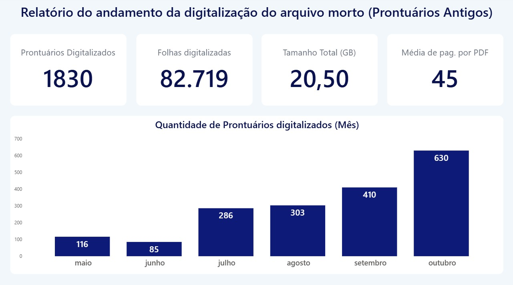

# 📂 PDF Archive Scanner — Digitalização de Arquivo Morto

Ferramenta desenvolvida para monitorar e acompanhar em tempo real
o progresso de um projeto de digitalização de arquivo físico de RH.

## 🧩 Contexto

A empresa possuía um arquivo morto físico com prontuários de 
funcionários que precisavam ser digitalizados. Liderei uma equipe 
de 5 aprendizes responsáveis pela digitalização, onde cada membro 
salvava os PDFs numa pasta compartilhada na nuvem (OneDrive).

O problema: não havia visibilidade do progresso. Não sabíamos 
quantos documentos já tinham sido digitalizados, quantas páginas 
foram processadas ou quem estava evoluindo mais.

## 💡 Solução

Script Python que varre a pasta na nuvem e extrai automaticamente:

- Nome do arquivo
- Número de páginas
- Tamanho em MB
- Data de modificação

Os dados são exportados para Excel e conectados a um dashboard 
no Power BI, permitindo acompanhar a evolução da digitalização 
em tempo real.

## 📊 Resultado

- Visibilidade total do progresso do projeto
- Gestão da equipe baseada em dados reais
- Projeto elogiado pela liderança e reconhecido internamente

## 🛠️ Stack

Python · PyMuPDF · Pandas · Power BI · OneDrive

## ▶️ Como usar

1. Instale as dependências:
pip install pymupdf pandas openpyxl

2. Edite as variáveis no topo do arquivo:
CAMINHO_PASTA_PDFS → pasta com os PDFs
CAMINHO_PLANILHA   → onde salvar o Excel

3. Execute:
python scanner.py

A cada execução, apenas PDFs novos são adicionados à planilha
(processamento incremental).
